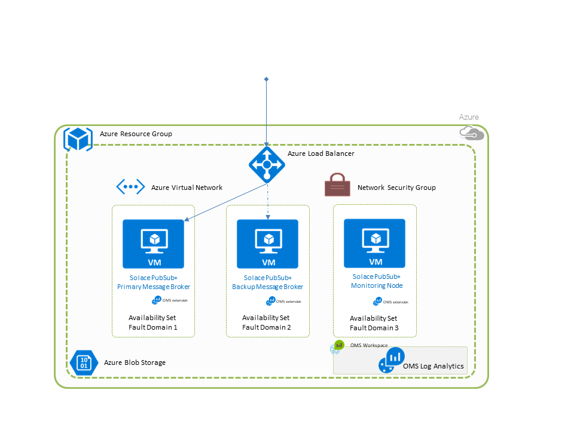

# Deploy either a standalone Solace Message Router or a three node High Availability cluster of Solace Message Routers onto Azure Linux VM(s).

The Solace Virtual Message Router (VMR) is enterprise-grade messaging middleware that meets the needs of big data, cloud migration, and internet of things initiatives, and enables microservices and event-driven architecture. Capabilities include topic-based publish/subscribe, request/reply, message queues/queueing, and data streaming for IoT devices and mobile/web apps. The VMR supports open APIs and standard protocols including AMQP, JMS, MQTT, REST, and WebSocket. The VMR can be deployed in on-premise datacenters, natively within private and public clouds, and across complex hybrid cloud environments.


How to Deploy a VMR
-------------------

VMRs can either be deployed as a 3 node HA cluster or a single node. For simple test environments that need to validate application functionality, a single instance will suffice.


Note that in production or any environment where message loss can not be tolerated, an HA cluster is required.




This is a 2 step process:

* Go to the Solace Developer portal and request a Solace Community edition VMR or Evaluation edition VMR. This process will return an email with a Download link. Do a right click "Copy Hyperlink" on the "Download the VMR for Docker" hyperlink. This URL link will be needed in the following section. The link below will take you to the correct version of the VMR you require depending on whether you want a single instance or an HA Cluster.

| COMMUNITY EDITION FOR SINGLE NODE | EVALUATION EDITION FOR HA CLUSTER
| --- | --- |
<a href="http://dev.solace.com/downloads/download_vmr-ce-docker" target="_blank">
    
</a> 

<a href="http://dev.solace.com/downloads/download-vmr-evaluation-edition-docker/" target="_blank">
    
</a>


* Hit the "Deploy to Azure" button, and in the deployment template add the link to the VMR provided by Solace. 

<a href="https://portal.azure.com/#create/Microsoft.Template/uri/https%3A%2F%2Fraw.githubusercontent.com%2FSolaceDev%2Fsolace-azure-quickstart-template%2FSOL-1257%2Fazuredeploy.json" target="_blank">
    
</a>
<a href="http://armviz.io/#/?load=https%3A%2F%2Fraw.githubusercontent.com%2FSolaceDev%2Fsolace-azure-quickstart-template%2FSOL-1257%2Fazuredeploy.json" target="_blank">
    
</a>

The fields that you need to fill out are:
1.  Resource Group - A new group, or an existing group that will be available from the pull-down menu once "Use existing" is selected.
2.  Location - Select region most suitable to you.
3.  Storage Account Name - New or existing storage account, where your VHD will be stored.
4.  Admin Username - Username for the virtual Machine(s).
5.  Admin Password - Password for the virtual Machine(s) and for the admin CLI user.
6.  Security Group Name - New or existing security group, where VMR default ports will be made publicly available.
7.  DNS Label for LB IP - Used for the public DNS name of the Load Balancer.
8.  DNS Label for VM IP - Used for the public DNS name of each virtual Machine(s).
9.  CentOS Version - Use CentOS 7.2, 7.3, or 7.4.
10. VM Size - Use Standard_D2_v2, Standard_D2_v3, Standard_F2s, or Standard_F2s_v2.
11. Solace VMR URI - The URI link from the registration email received during Step 1 of the install process.
12. Deployment Model - High Availability or Single Node.


After completing the template fields and accepting the legal terms, you need to purchase the deployment, the cost will only be related to the Azure instance costs.

Once the deployment has started you can view its progress under the Resource Groups tab. Select the resource group you have deployed into, then select the correct deployment across the top. You can then scroll down and see its progress. 

In this example the resource group is testvmr3, the Microsoft.Template template is in progress.  You can see the VMs have started, SolaceVMR0,1,2; the Docker extensions have been installed and the VMR configurations are taking place.  Once the VMRs are configured, the Primary VMR validates the cluster and will signal the deployment complete. After this point you can access the VMRs.


In addition to the above resources, the deployment creates an Azure Load Balancer that gives you management and data access to the currently AD-Active VMR.

Microsoft OMS (Operations Management Suite) Agents are also installed on each VMR to collect and send logs to a new or existing Azure Log Analytics workspace that aggregates logs and diagnostics of each virtual machine in the deployment.


# Gaining admin access to the VMR

For persons used to working with Solace message router console access, this is still available with the Azure instance.  The [connect] button to the upper left displays this information: Use the "Admin Username" and "Admin Password" provided.


Once you have access to the base OS command line you can access the SolOS CLI with the following command:

```
sudo docker exec -it solace /usr/sw/loads/currentload/bin/cli -A
```

If you are unfamiliar with the Solace message router, or would prefer an administration application, the SolAdmin management application is available. For more information on SolAdmin see the [SolAdmin page](http://dev.solace.com/tech/soladmin/).  To get SolAdmin, visit the Solace [download page](http://dev.solace.com/downloads/) and select OS version desired.  Management IP will be the External IP associated with your Azure instance and the port will be 8080 by default.


To manage the currently AD-Active VMR, you can open a CLI SSH connection (on port 2222) or connect SolAdmin (on port 8080) to the Public IP address (myLBPublicIPD) associated with the Load balancer (myLB) as the admin user.


# Testing data access to the VMR

To test data traffic though the newly created VMR instance, visit the Solace developer portal and and select your preferred programming language to [send and receive messages](http://dev.solace.com/get-started/send-receive-messages/). Under each language there is a Publish/Subscribe tutorial that will help you get started.


# Troubleshouting VMR startup

All startup logs are located here: /var/lib/waagent/custom-script/download/0/ and are readable by root only.
Host and Container logs and diagnostics are collected and aggregated in a Azure Log Analytics workspace that can be viewed and analyzed from the Azure Portal under More services > Intelligence + Analytics > Log Analytics.

## Contributing

Please read [CONTRIBUTING.md](CONTRIBUTING.md) for details on our code of conduct, and the process for submitting pull requests to us.

## Authors

See the list of [contributors](../graphs/contributors) who participated in this project.

## License

This project is licensed under the Apache License, Version 2.0. - See the [LICENSE](LICENSE) file for details.

## Resources

For more information about writing Azure Resource Manager(ARM) templates and Azure quickstart templates try these resources:

- [Authoring Azure Resource Manager templates](https://docs.microsoft.com/en-us/azure/azure-resource-manager/resource-group-authoring-templates)
- [Azure Quickstart Templates](https://azure.microsoft.com/en-us/resources/templates/)

For more information about Solace technology in general please visit these resources:

- [Solace Developer Portal](http://dev.solace.com)
- [Intro Solace technology](http://dev.solace.com/tech/)
- [Solace community on Stack Overflow](http://dev.solace.com/community/).
